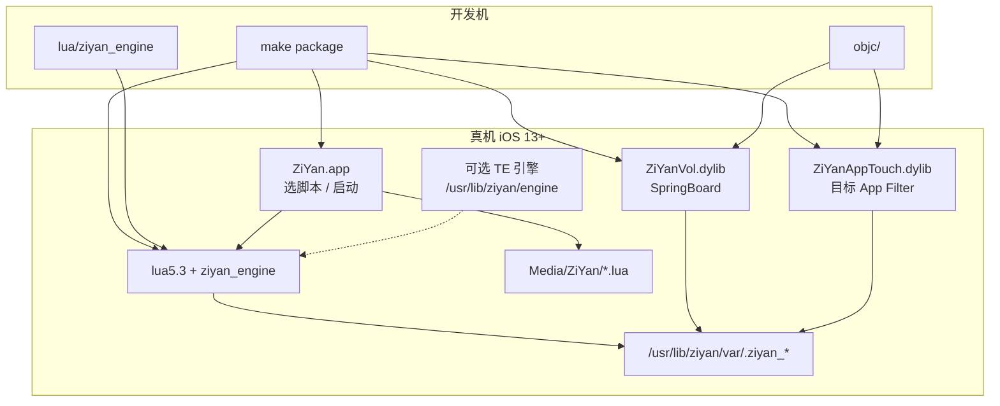

# ZiYan 项目说明

## 1. 一句话定位

越狱 iOS 上的 **Lua 自动化引擎**：图色 / 触控 / OCR / 应用控制 / 运行控制；兼容触动·触摸精灵全局 API 习惯，自研实现，不拷贝专有二进制逻辑。

## 2. 架构图



| 层 | 组件 | 职责 |
|----|------|------|
| UI | ZiYan.app | 选脚本、写启动器、启停 |
| SB Tweak | ZiYanVol | 音量菜单、Toast、截屏找色、桌面图标点击兜底 |
| App Tweak | ZiYanAppTouch | 游戏内 HID/UITouch、MemHook |
| Lua | ziyan_engine | 脚本全局 API |
| IPC | `.ziyan_*` 文件 | 跨进程请求/回执 |
| Engine | vendor 守护（可选） | TE 兼容；失败则 `lua5.3` + `ziyan_run.lua` |

## 3. 目录说明

| 路径 | 一句话 |
|------|--------|
| `Makefile` / `control` / `*.plist` | Theos 入口与 Filter |
| `STRUCTURE.md` | 仓库结构速览 |
| `README.md` | 项目说明摘要 |
| `DOCS/` | 详版项目说明 / API / 清理报告 |
| `objc/` | App / tweak / shared / `_archive`（未接入） |
| `lua/` | 脚本 API **唯一真相源** |
| `api_spec/` | 契约 catalog / modules / compat / 真机报告 |
| `layout/` | 装机路径镜像（用户脚本、tessdata、DEBIAN） |
| `tools/` | OCR/mem CLI、冒烟、取色 GUI、门禁脚本 |
| `vendor/` | 运行时二进制（lua/python/engine）— **慎删** |
| `Resources/` | App 资源 |
| `probes/` | 本地探测产物（不打包） |
| `packages/` | 构建 deb（仅保留最近 N 个） |
| `.theos/` | Theos 中间产物（可 clean） |

## 4. 运行时路径表

| 路径 | 用途 |
|------|------|
| `/usr/lib/ziyan/lib/lua/` | 引擎 Lua（含 `ziyan_engine/`） |
| `/usr/lib/ziyan/bin/` | `lua5.3` / `python3` / `ziyan_ocr` / `ziyan_mem` |
| `/usr/lib/ziyan/engine/` | 可选 TE 兼容守护 |
| `/usr/lib/ziyan/var/` | IPC：`.ziyan_orient` `.ziyan_color_*` `.ziyan_touch_*` `.ziyan_cmd` 等 |
| `/usr/lib/ziyan/runtime/` | 启动器 / 兼容链数据 |
| `/private/var/mobile/Media/ZiYan/` | **用户脚本**真相源 |
| `/Library/MobileSubstrate/DynamicLibraries/` | ZiYanVol / ZiYanAppTouch |

常用 IPC：

| 文件 | 用途 |
|------|------|
| `.ziyan_orient` | `init` 方向 + 逻辑分辨率 |
| `.ziyan_color_req/rep` | 找色 / dumpScreen |
| `.ziyan_touch_req/rep` | 触控 |
| `.ziyan_cv_shot.png` | OCR 截屏缓存 |
| `.ziyan_sb_alive` | SpringBoard 桥存活 |
| `.ziyan_app_alive` | AppTouch 存活 |

## 5. 构建与安装

```bash
# 开发机（需 Theos）
make package          # → packages/com.ziyan.ziyan_*.deb

# 真机安装 + 冒烟
bash tools/device_smoke.sh
# 或
ssh root@<IP> 'dpkg -i /tmp/ziyan.deb; sbreload'   # 截屏异常时优先 reboot，慎用反复 killall SB
```

- **deployment**：`Makefile` → `iphone:clang:latest:13.0`，`ARCHS=arm64`
- 最新包示例：`0.0.81-14+debug`（以 `packages/` 为准）

## 6. 真机验收入口

| 脚本 | 路径 | 用途 |
|------|------|------|
| `_ziyan_smoke.lua` | `layout/.../Media/ZiYan/` | 最小冒烟 |
| `_ziyan_api_test.lua` | 同上 | API 分项 |
| `_ziyan_html_api_test.lua` | 同上 | HTML 报告向 |
| `login_xztl.lua` | 同上 | 用户业务脚本（找色+点击） |
| `tools/gate_t356.sh` | tools | T3/T5/T6 门禁 |
| `tools/device_smoke.sh` | tools | 安装 + smoke |

运行示例：

```bash
/usr/lib/ziyan/bin/lua5.3 /usr/lib/ziyan/lib/lua/ziyan_run.lua \
  /private/var/mobile/Media/ZiYan/_ziyan_smoke.lua
```

## 7. 跨版本声明

- **最低部署**：iOS 13.0（Theos target）
- **已验证环境**：iOS 13.1.2 / checkra1n / rootful（开发机记录）
- **策略摘要**：私有 API（`_UICreateScreenUIImage`、HID digitizer、SBIconView）按运行时 `dlsym`/`respondsToSelector` 探测；新系统需单独门禁，不保证 14–26 全量通过
- **兼容面**：吸收 TE/TS **API 语义**，禁止拷贝破解包 Mach-O / telib 专有实现（见 `api_spec/architecture.json`）

## 8. 清理记录

见 [`DOCS/CLEANUP_REPORT.md`](CLEANUP_REPORT.md)。

摘要：

- 已删：全部 `.DS_Store`、`probes/` 临时图与 `tmp_probe*.py`、旧 deb（仅留最新 2 个）
- 未删：`objc/_archive`、`vendor/*`、`.theos/`（本次未 `make clean`）
- packages 策略：默认保留最新 **2** 个 `com.ziyan.ziyan_*.deb`

## 9. 未决 / 风险

| 项 | 说明 |
|----|------|
| `objc/_archive/ZiYanHID.*` | 未接入 Makefile，仅归档 |
| `vendor/` 引擎二进制 | 构建 stage 强依赖；禁止自动删除 |
| api_spec 一致性 | 部分标 `done` 的符号在 lua 文本未检出（如 `clipText`、`ZiYanCV.*`）；部分 `planned` 已在 lua 出现名字（如 `keyDown`）— **未擅自改契约状态** |
| SpringBoard 截屏 | 反复 `killall -9 SpringBoard` 可能导致黑图，需 reboot 恢复 |
| TE 守护 | 常不稳定；验收以 `lua5.3` + `ziyan_run.lua` 为准 |
| AppTouch Filter | 由 plist 配置，源码不写死游戏 Bundle ID |

完整函数表：[`DOCS/API.md`](API.md)。
